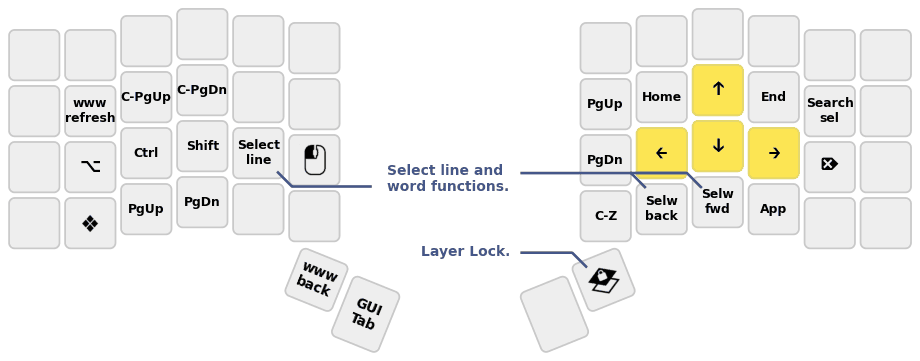
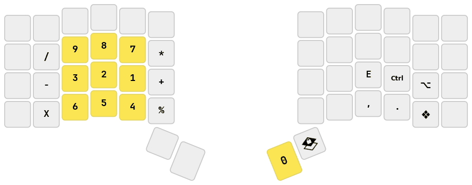
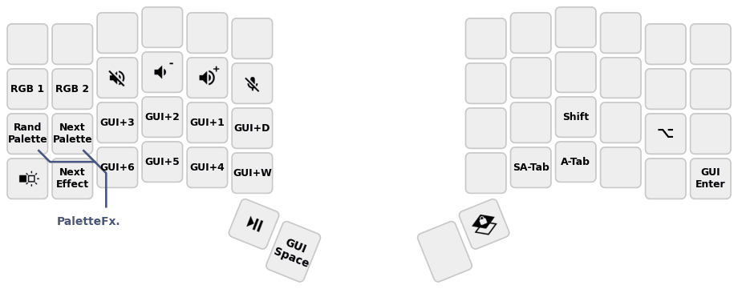
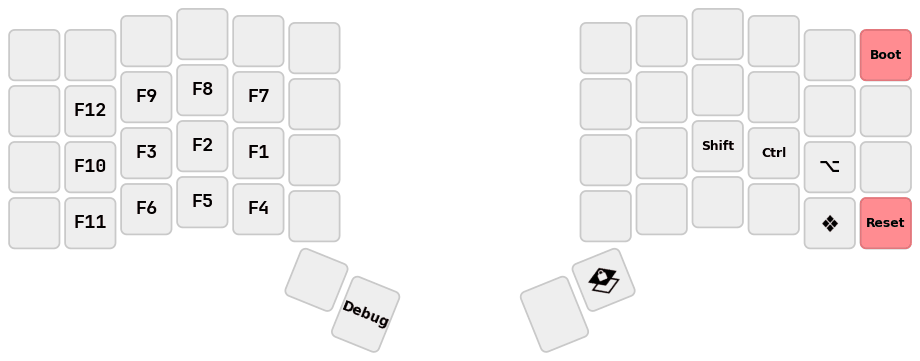
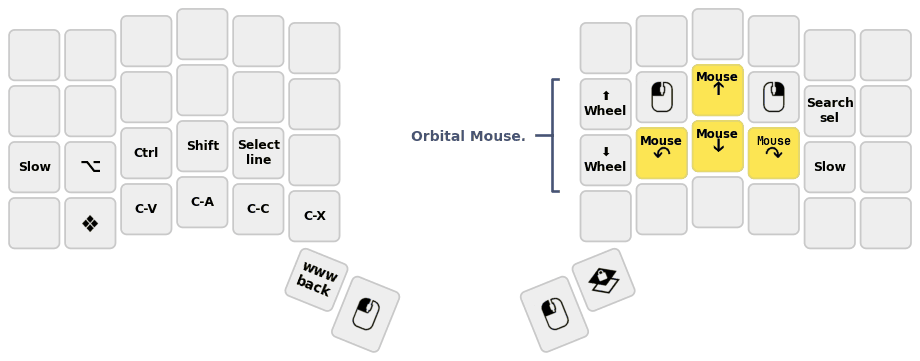

# @getreuer's QMK keymap

(This is not an officially supported Google product.)


This is my [Quantum Mechanical Keyboard (QMK)](https://docs.qmk.fm) keymap for
the Dactyl Ergodox, ZSA Moonlander, and ZSA Voyager keyboards. Who knew a
keyboard [could do so
much?](https://getreuer.info/posts/keyboards/tour/index.html)


## License

This repo uses the Apache License 2.0 except where otherwise indicated. See the
[LICENSE file](LICENSE.txt) for details.


## Feature libraries

Several features are developed as QMK community modules in
[getreuer/qmk-modules](https://github.com/getreuer/qmk-modules/), a git
submodule of this repo. The former pre-module code is under the
[features](features/). Detailed documentation can be found in the links below.
For developers, see also my post [developing QMK
features](https://getreuer.info/posts/keyboards/developing-qmk-features/index.html)
for general tips on writing userspace libraries and contributing to QMK.

* [Custom shift
  keys](https://getreuer.info/posts/keyboards/custom-shift-keys/index.html)
  &ndash; customize what keycode is produced when shifted

* [Lumino](https://getreuer.info/posts/keyboards/lumino/index.html) &ndash; a
  minimal, opinionated control scheme for RGB matrix lighting

* [Keycode String](https://getreuer.info/posts/keyboards/keycode-string/index.html)
  &ndash; format keycodes as human-readable strings

* [Mouse Turbo
  Click](https://getreuer.info/posts/keyboards/mouse-turbo-click/index.html)
  &ndash; macro that clicks the mouse rapidly

* [Orbital
  Mouse](https://getreuer.info/posts/keyboards/orbital-mouse/index.html) &ndash;
  a polar approach to mouse key control

* [PaletteFx](https://getreuer.info/posts/keyboards/palettefx/index.html) &ndash;
  palette-based animated RGB matrix lighting effects

* [Select Word](https://getreuer.info/posts/keyboards/select-word/index.html)
  &ndash; macro for convenient word or line selection

* [Sentence Case](https://getreuer.info/posts/keyboards/sentence-case/index.html)
  &ndash; automatically capitalize the first letter of sentences

* [SOCD Cleaner](https://getreuer.info/posts/keyboards/socd-cleaner/index.html)
  &ndash; enhance WASD for fast inputs for gaming

* [Tap Flow](https://getreuer.info/posts/keyboards/tap-flow/index.html)
  &ndash; disable HRMs during fast typing (Global Quick Tap)

The following were originally developed here and have since graduated to become
QMK core features. It is recommended to use the QMK core implementations, but
(perhaps for sake of customization or curiosity) you may continue to use these
userspace versions:

* [Achordion](https://getreuer.info/posts/keyboards/achordion/index.html)
  &ndash; userspace predecessor of [QMK's Chordal
  Hold](https://docs.qmk.fm/tap_hold#chordal-hold)

* [Autocorrection](https://getreuer.info/posts/keyboards/autocorrection/index.html)
  &ndash; userspace version of [QMK's
  Autocorrect](https://docs.qmk.fm/features/autocorrect)

* [Caps Word](https://getreuer.info/posts/keyboards/caps-word/index.html)
  &ndash; userspace version of [QMK's Caps
  Word](https://docs.qmk.fm/features/caps_word)

* [Layer Lock key](https://getreuer.info/posts/keyboards/layer-lock/index.html)
  &ndash; userspace version of [QMK's Layer
  Lock](https://docs.qmk.fm/features/layer_lock)

* [Repeat Key](https://getreuer.info/posts/keyboards/repeat-key/index.html)
  &ndash; userspace version of [QMK's Repeat
  Key](https://docs.qmk.fm/features/repeat_key)


## My keymap

Here is a visualization of my keymap. See [getreuer.c](getreuer.c) for full
details.

**Base layer** ([Magic
Sturdy](https://getreuer.info/posts/keyboards/alt-layouts/index.html#magic-sturdy) with home row mods)


**Symbol layer**


**Navigation layer**



**Numpad layer**



**Window management layer**



**Funky fun layer**



**Extras and mouse layer**




## Installation

This repo works as an [External QMK
Userspace](https://docs.qmk.fm/newbs_external_userspace) and makes use of the
[Community Modules](https://docs.qmk.fm/features/community_modules) support
added in QMK Firmware 0.28.0, released 2025-02-27. Instructions on how to use
it in QMK:

1. [Set up QMK](https://docs.qmk.fm/newbs) or [update your QMK set
   up](https://docs.qmk.fm/newbs_git_using_your_master_branch#updating-your-master-branch)
   to get the latest.

2. Clone this repo locally

   ```sh
   git clone --recurse-submodules https://github.com/getreuer/qmk-keymap
   ```

3. Run the following shell command, replacing "`path/to/qmk-keymap`" with the
   relative path to your clone of `qmk-keymap` from the previous step:

   ```sh
   qmk config user.overlay_dir="$(realpath path/to/qmk-keymap)"
   ```

My keymap may then be compiled and flashed with

```sh
# Dactyl Ergodox
qmk flash -kb handwired/dactyl_promicro -km getreuer
# ZSA Moonlander
qmk flash -kb zsa/moonlander -km getreuer
# ZSA Voyager
qmk flash -kb zsa/voyager -km getreuer
```

