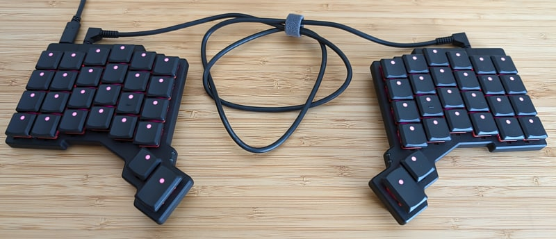
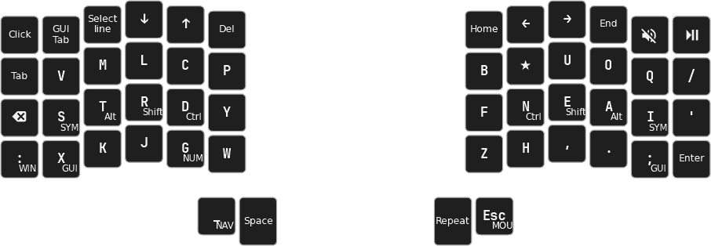
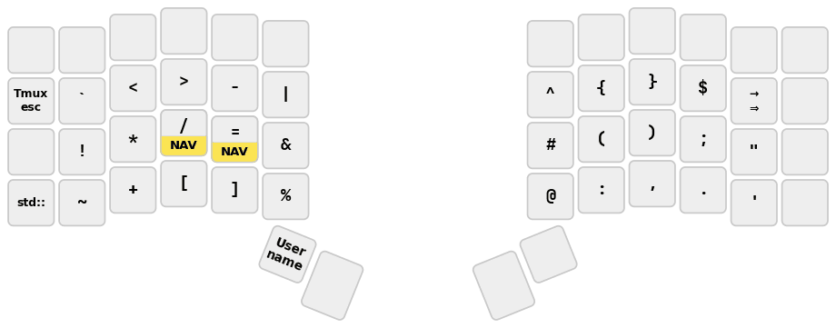
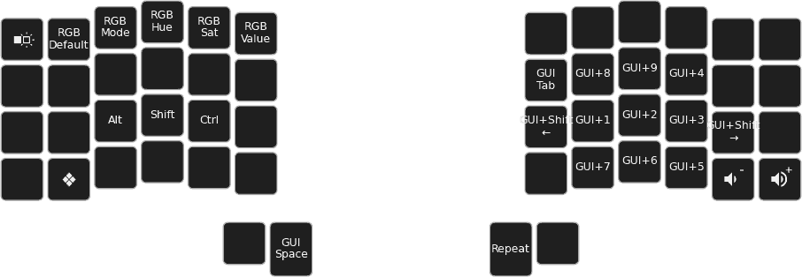
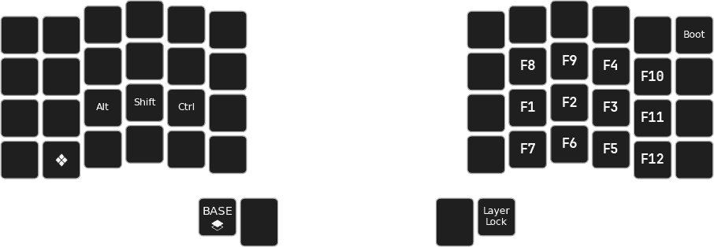

# Pascal Getreuer's QMK keymap

(This is not an officially supported Google product.)



This is my [Quantum Mechanical Keyboard (QMK)](https://docs.qmk.fm) keymap for
the Dactyl Ergodox, ZSA Moonlander, and ZSA Voyager keyboards. Who knew a
keyboard [could do so
much?](https://getreuer.info/posts/keyboards/tour/index.html)


## License

This repo uses the Apache License 2.0 except where otherwise indicated. See the
[LICENSE file](LICENSE.txt) for details.


## Feature libraries

Several userspace feature libraries for QMK are developed in this repo. Code is
under the [features](features/) directory and detailed documentation can be
found in the links below. For developers, see also my post [developing QMK
features](https://getreuer.info/posts/keyboards/developing-qmk-features/index.html)
for general tips on writing userspace libraries and contributing to QMK.

* [Achordion](https://getreuer.info/posts/keyboards/achordion/index.html)
  &ndash; customize the tap-hold decision

* [Autocorrection](https://getreuer.info/posts/keyboards/autocorrection/index.html)
  &ndash; run rudimentary autocorrection on your keyboard

* [Caps Word](https://getreuer.info/posts/keyboards/caps-word/index.html)
  &ndash; modern alternative to Caps Lock

* [Custom shift
  keys](https://getreuer.info/posts/keyboards/custom-shift-keys/index.html)
  &ndash; they're surprisingly tricky to get right; here is my approach

* [Layer Lock key](https://getreuer.info/posts/keyboards/layer-lock/index.html)
  &ndash; macro to stay in the current layer

* [Mouse Turbo
  Click](https://getreuer.info/posts/keyboards/mouse-turbo-click/index.html)
  &ndash; macro that clicks the mouse rapidly

* [Orbital
  Mouse](https://getreuer.info/posts/keyboards/orbital-mouse/index.html) &ndash;
  a polar approach to mouse key control

* [Repeat Key](https://getreuer.info/posts/keyboards/repeat-key/index.html)
  &ndash; an extensible "repeat last key" implementation

* [Sentence Case](https://getreuer.info/posts/keyboards/sentence-case/index.html)
  &ndash; automatically capitalize the first letter of sentences

* [SOCD Cleaner](https://getreuer.info/posts/keyboards/socd-cleaner/index.html)
  &ndash; enhance WASD for fast inputs for gaming

* [Word selection](https://getreuer.info/posts/keyboards/select-word/index.html)
  &ndash; macro for convenient word or line selection


## My keymap

Here is a visualization of my keymap. See the [Dactyl
keymap.c](keyboards/handwired/dactyl_promicro/keymaps/getreuer/keymap.c),
[Moonlander keymap.c](keyboards/zsa/moonlander/keymaps/getreuer/keymap.c), or
[Voyager keymap.c](keyboards/zsa/voyager/keymaps/getreuer/keymap.c) and
[getreuer.c](getreuer.c) for full details.

**Base layer** ([Magic
Sturdy](https://getreuer.info/posts/keyboards/alt-layouts/index.html#magic-sturdy) with home row mods)



**Symbol layer**



**Numpad layer**


**Window management layer**



**Funky fun layer**




## Installation

This repo works as an [External QMK
Userspace](https://docs.qmk.fm/newbs_external_userspace). Instructions on how
to use it in QMK:

1. [Set up QMK](https://docs.qmk.fm/newbs).

2. Clone this repo locally

   ```sh
   git clone https://github.com/getreuer/qmk-keymap
   ```

3. Run the following shell command, replacing "`path/to/qmk-keymap`" with the
   relative path to your clone of `qmk-keymap` from the previous step:

   ```sh
   qmk config user.overlay_dir="$(realpath path/to/qmk-keymap)"
   ```

My keymap may then be compiled and flashed with

```sh
# Dactyl Ergodox
qmk flash -kb handwired/dactyl_promicro -km getreuer
# ZSA Moonlander
qmk flash -kb zsa/moonlander -km getreuer
# ZSA Voyager
qmk flash -kb zsa/voyager -km getreuer
```

