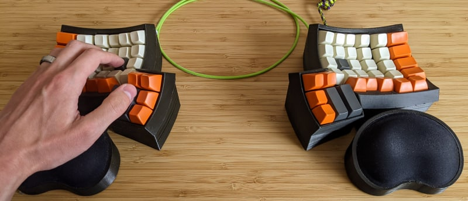
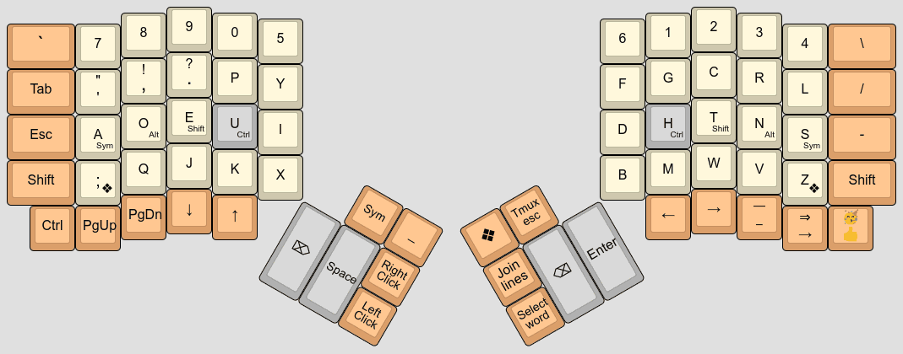
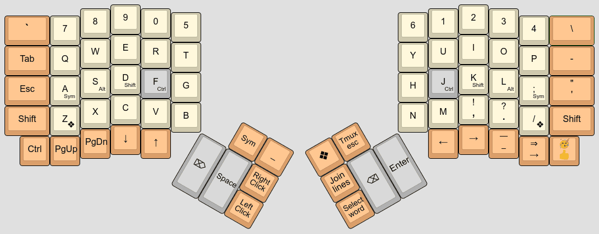
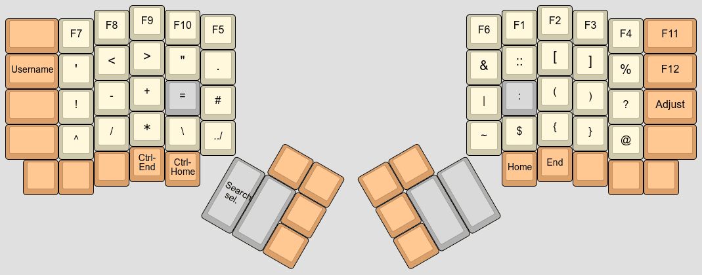
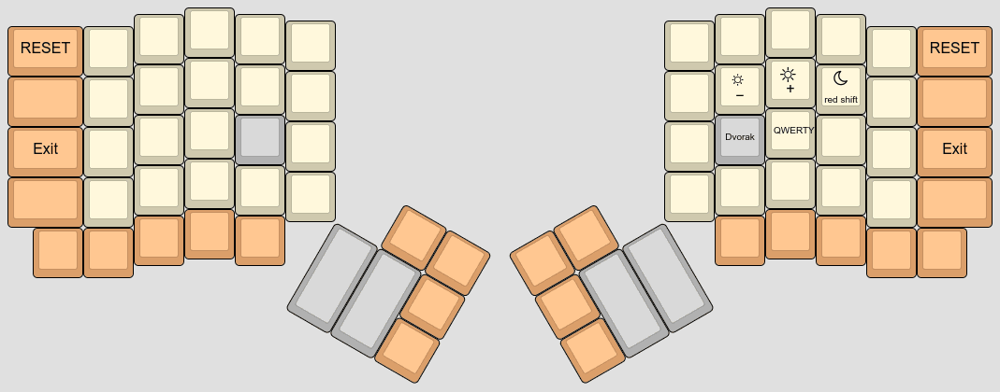

# Pascal Getreuer's QMK keymap

(This is not an officially supported Google product.)

This is my [Quantum Mechanical Keyboard (QMK)](https://docs.qmk.fm) keymap for
the [Dactyl
Ergodox](https://ohkeycaps.com/products/built-to-order-dactyl-manuform-keyboard).
Who knew a keyboard could do so much?

### Topics

**Feature libraries**

* [Achordion](https://getreuer.info/posts/keyboards/achordion/index.html)
  &ndash; customize the tap-hold decision

* [Autocorrection](https://getreuer.info/posts/keyboards/autocorrection/index.html)
  &ndash; run rudimentary autocorrection on your keyboard

* [Caps Word](https://getreuer.info/posts/keyboards/caps-word/index.html)
  &ndash; modern alternative to Caps Lock

* [Custom shift
  keys](https://getreuer.info/posts/keyboards/custom-shift-keys/index.html)
  &ndash; they're surprisingly tricky to get right; here is my approach

* [Layer Lock key](layer-lock/index.html) &ndash; macro to stay in the current
  layer

* [Mouse Turbo
  Click](https://getreuer.info/posts/keyboards/mouse-turbo-click/index.html)
  &ndash; macro that clicks the mouse rapidly

* [Word selection](https://getreuer.info/posts/keyboards/select-word/index.html)
  &ndash; macro for convenient word or line selection

**Tutorials**

* [Macro buttons](https://getreuer.info/posts/keyboards/macros/index.html)
  &ndash; an assortment of practical QMK macros

* [Triggers: reacting to interesting
  events](https://getreuer.info/posts/keyboards/triggers/index.html) &ndash;
  layer changes, tap vs. long press, etc.

 
**General**

* [Alt keyboard
  layouts](https://getreuer.info/posts/keyboards/alt-layouts/index.html) &ndash;
  switching from QWERTY to an alternative keyboard layout

* [Designing a symbol
  layer](https://getreuer.info/posts/keyboards/symbol-layer/index.html) &ndash;
  ergonomic and character frequency considerations

* [Questioning the ergonomics of 40%
  keyboards](https://getreuer.info/posts/keyboards/40-percent-ergo/index.html)
  &ndash; smaller is not necessarily better

* [Keyboard FAQS](https://getreuer.info/posts/keyboards/faqs/index.html) &ndash;
  thoughts on topics that come up regularly

* [Links about
  keyboards](https://getreuer.info/posts/keyboards/links/index.html) &ndash;
  interesting links about keyboards and related topics

## My keymap

Here is a [KLE visualization](http://www.keyboard-layout-editor.com/) of my
keymap. See the [keymap.c](keymap.c) itself for full details.

**Base layer** (Dvorak with home row mods)

**QWERTY layer**

**Symbol layer**

**Adjust layer**

## License

This code uses the Apache License 2.0. See the [LICENSE file](LICENSE.txt) for
details.

## Installation

Clone the [QMK firmware](https://github.com/qmk/qmk_firmware) and place this
repo in `qmk_firmware/keyboards/handwired/dactyl_promicro/keymaps/getreuer`.

