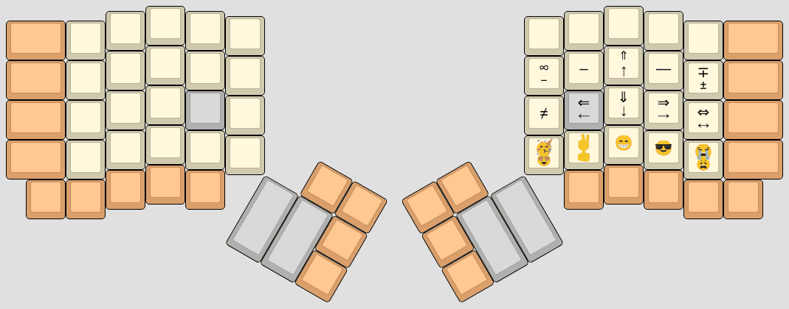

# Pascal Getreuer's QMK keymap

(This is not an officially supported Google product.)

This is my [Quantum Mechanical Keyboard (QMK)](https://docs.qmk.fm) keymap for
the [Dactyl
Ergodox](https://ohkeycaps.com/products/built-to-order-dactyl-manuform-keyboard).
Who knew a keyboard could do so much?

## My keymap

Here is a [KLE](http://www.keyboard-layout-editor.com/) visualization of my
keymap. See the [keymap.c](keymap.c) itself for full details.

**Base layer** (Dvorak)

**QWERTY layer**

**Symbol layer**

**Unicode layer**

## License

This code uses the Apache License 2.0. See the [LICENSE file](LICENSE.txt) for
details.

## Installation

Clone the [QMK firmware](https://github.com/qmk/qmk_firmware) and place this
repo in `qmk_firmware/keyboards/handwired/dactyl_promicro/keymaps/getreuer`.

