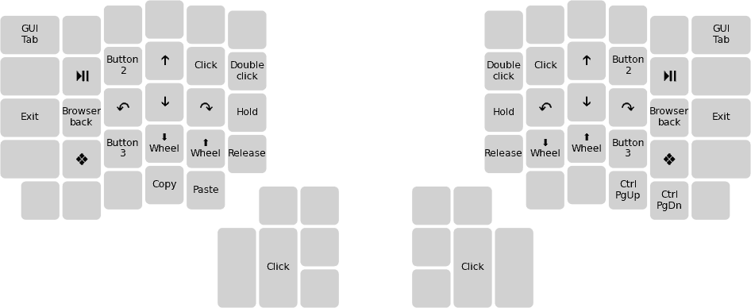

# Pascal Getreuer's QMK keymap

(This is not an officially supported Google product.)

This is my [Quantum Mechanical Keyboard (QMK)](https://docs.qmk.fm) keymap for
the [Dactyl
Ergodox](https://ohkeycaps.com/products/built-to-order-dactyl-manuform-keyboard).
Who knew a keyboard [could do so
much?](https://getreuer.info/posts/keyboards/tour/index.html)

### Topics

**Feature libraries**

* [Achordion](https://getreuer.info/posts/keyboards/achordion/index.html)
  &ndash; customize the tap-hold decision

* [Autocorrection](https://getreuer.info/posts/keyboards/autocorrection/index.html)
  &ndash; run rudimentary autocorrection on your keyboard

* [Caps Word](https://getreuer.info/posts/keyboards/caps-word/index.html)
  &ndash; modern alternative to Caps Lock

* [Custom shift
  keys](https://getreuer.info/posts/keyboards/custom-shift-keys/index.html)
  &ndash; they're surprisingly tricky to get right; here is my approach

* [Layer Lock key](https://getreuer.info/posts/keyboards/layer-lock/index.html)
  &ndash; macro to stay in the current layer

* [Mouse Turbo
  Click](https://getreuer.info/posts/keyboards/mouse-turbo-click/index.html)
  &ndash; macro that clicks the mouse rapidly

* [Orbital
  Mouse](https://getreuer.info/posts/keyboards/orbital-mouse/index.html) &ndash;
  a polar approach to mouse key control

* [Repeat Key](https://getreuer.info/posts/keyboards/repeat-key/index.html)
  &ndash; an extensible "repeat last key" implementation

* [Sentence Case](https://getreuer.info/posts/keyboards/sentence-case/index.html)
  &ndash; automatically capitalize the first letter of sentences

* [Word selection](https://getreuer.info/posts/keyboards/select-word/index.html)
  &ndash; macro for convenient word or line selection

**QMK**

* [Macro buttons](https://getreuer.info/posts/keyboards/macros/index.html)
  &ndash; an assortment of practical QMK macros

* [Triggers: reacting to interesting
  events](https://getreuer.info/posts/keyboards/triggers/index.html) &ndash;
  layer changes, tap vs. long press, etc.

* [Typing non-English
  letters](https://getreuer.info/posts/keyboards/non-english/index.html) &ndash;
  several approaches to type symbols like &auml;, &ccedil;, &lambda;

* [QMK song
  player](https://getreuer.info/posts/keyboards/qmk-song-player/index.html)
  &ndash; play QMK song code in your browser 
 
**General**

* [Alt keyboard
  layouts](https://getreuer.info/posts/keyboards/alt-layouts/index.html) &ndash;
  switching from QWERTY to an alternative keyboard layout

* [Designing a symbol
  layer](https://getreuer.info/posts/keyboards/symbol-layer/index.html) &ndash;
  ergonomic and character frequency considerations

* [Questioning the ergonomics of 40%
  keyboards](https://getreuer.info/posts/keyboards/40-percent-ergo/index.html)
  &ndash; smaller is not necessarily better

* [PSA: Thumbs can get overuse
  injuries](https://getreuer.info/posts/keyboards/thumb-ergo/index.html) &ndash;
  anecdotes, common injuries, countermeasures

* [Keyboard FAQS](https://getreuer.info/posts/keyboards/faqs/index.html) &ndash;
  thoughts on topics that come up regularly

* [Links about
  keyboards](https://getreuer.info/posts/keyboards/links/index.html) &ndash;
  interesting links about keyboards and related topics

## My keymap

Here is a visualization of my keymap. See the [keymap.c](keymap.c) itself for
full details.

**Base layer** ([Magic
Sturdy](https://getreuer.info/posts/keyboards/alt-layouts/index.html#magic-sturdy) with home row mods)

**QWERTY layer**

**Symbol layer**

**Mouse layer**

**Adjust layer**

## License

This repo uses the Apache License 2.0 except where otherwise indicated. See the
[LICENSE file](LICENSE.txt) for details.

## Installation

This repo works as an [External QMK
Userspace](https://docs.qmk.fm/#/newbs_external_userspace). Instructions on how
to use it in QMK:

1. [Set up QMK](https://docs.qmk.fm/#/newbs).

2. Clone this repo locally

   ~~~{.sh}
   git clone https://github.com/getreuer/qmk-keymap
   ~~~

3. Run the following shell command, replacing "`path/to/qmk-keymap`" with the
   relative path to your clone of `qmk-keymap` from the previous step:

   ~~~{.sh}
   qmk config user.overlay_dir="$(realpath path/to/qmk-keymap)"
   ~~~

My keymap may then be compiled and flashed with

~~~{.sh}
# Dactyl Ergodox
qmk flash -kb handwired/dactyl_promicro -km getreuer
~~~

